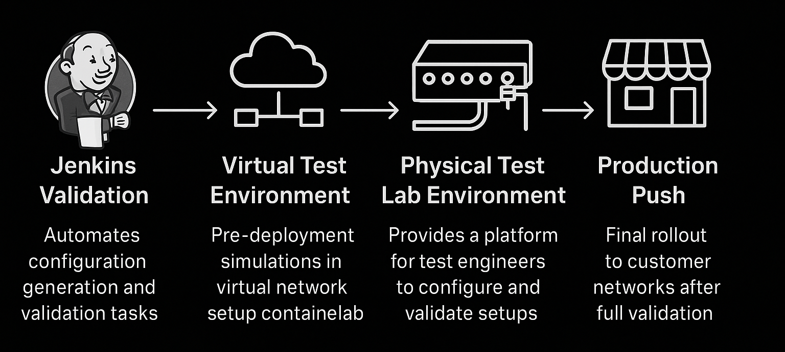

# NAutoBuff — Network Management & Automation System

NAutoBuff is a **Network Management and Automation System (NMAS)** that acts as a centralized **Network Source of Truth (NSoT)**. It combines a Flask web UI, Containerlab virtual topology management, AI-assisted network operations, gNMI/SNMP telemetry, and a Jenkins CI/CD pipeline into a single open-source platform.


---

## What is a Network Source of Truth?

A Network Source of Truth (NSoT) is a single, reliable reference for all network data — configurations, device states, IP addresses, and inventory. Instead of managing devices individually, everything flows through one place.

NAutoBuff's NSoT lives in the `NSOT/` directory:

| Directory | Purpose |
|---|---|
| `GUI/` | Flask web interface (port 5555) |
| `python-files/` | Config generation, deployment, health checks, SNMP/gNMI |
| `golden_configs/` | Pre-validated configuration snapshots for rollback |
| `IPAM/` | IP Address Management and device inventory (`hosts.csv`) |
| `templates/` | Jinja2 templates for building device configs |
| `machine_learning/` | AI pipeline — intent extraction, CLI interpretation, config generation |
| `mcp/` | MCP servers for Claude/ChatGPT Desktop integration |
| `logs/` | Application log (`nautobuff.log`) and ngrok tunnel log |

---

## Features

| Feature | Description |
|---|---|
| **Topology Builder** | Deploy/destroy Containerlab topologies from the UI |
| **Config Generator** | Build device configs from Jinja2 templates (BGP, OSPF, RIP, VLANs, DHCP, Subinterfaces) |
| **Config Push** | Push configs to devices via SSH (Netmiko) with CI/CD validation |
| **Config Rollback** | Atomic configure-session replace to golden config — credentials auto-synced from inventory |
| **Console Access** | Interactive browser-based SSH terminal for each device (xterm.js + WebSocket) |
| **IPAM** | Live SNMP-polled IP address table; sync IPs from Containerlab with one button |
| **Device Health** | CPU, interface, route, and LLDP neighbor health checks |
| **Telemetry** | gNMI streaming via gnmic → InfluxDB → Grafana dashboard |
| **AI Assistant (NBot)** | Natural language queries AND configuration via Ollama LLM — full CI/CD pipeline triggered on configure |
| **Model Selector** | Switch between any locally installed Ollama model from the chat UI |
| **MCP Servers** | Claude/ChatGPT Desktop can query and configure devices via MCP tools |
| **Service Health Check** | Start/stop/restart/nuke all project services from the burger menu |
| **External Links** | Grafana, InfluxDB, and Jenkins URLs always accessible from the nav menu |
| **Password Rotation** | Automatic credential rotation on all devices every 30 minutes |
| **App Logging** | Timestamped log at `NSOT/logs/nautobuff.log` |

---

## CI/CD Pipeline

Every config change pushed through the web UI or AI chatbot goes through a full CI/CD pipeline:



1. Config rendered from a Jinja2 template
2. Committed to Git and pushed to GitHub automatically
3. Jenkins picks it up via GitHub webhook
4. Pipeline runs: flake8 lint → YAML lint → unit tests
5. On success, config deployed to the device via Netmiko SSH

---

## AI Assistant — NBot

NBot is a local AI assistant powered by **Ollama** (no cloud, no API keys, fully free).

**Read-only queries:**
```
"Show BGP neighbors on R1"
"What's the MAC address of R2?"
"Get interface errors on Ethernet1 on R1"
```

**Configuration (triggers full CI/CD pipeline):**
```
"Configure VLAN 111 named test on R1"
"Set up OSPF process 1 on R2 with network 10.0.0.0/24 area 0"
"Add BGP neighbor 10.0.0.2 remote-as 65002 on R1"
```

### MCP Integration

`NSOT/mcp/` contains two FastMCP servers for Claude Desktop or ChatGPT Desktop:
- `dut_query.py` — query devices (list inventory, run show commands)
- `dut_config.py` — configure devices (apply templates, rollback, backup)

Credentials are read from `hosts.csv` — no credentials are passed as tool parameters.

---

## How Rollback Works

Rollback uses Arista's **configure session** with `rollback clean-config` — an atomic transaction that replaces the entire running config in one commit.

Before every rollback:
1. Current password is read from `hosts.csv`
2. Credential lines in the golden config are patched with current credentials
3. Patched config is pushed inside a configure session and committed atomically

This means rollback never reverts a password rotation.

> **Important:** Golden configs must include the `Management0` interface. Always retake golden configs while devices are reachable using **Tools → Golden Config Generator**.

---

## Network OS Images

Vendor images are not included in this repo. Download and import your image manually before running `pilot.sh`. Refer to the [containerlab supported kinds documentation](https://containerlab.dev/manual/kinds/) for download and import instructions for each vendor.

---

## Setup

### Prerequisites

- **Linux** — Ubuntu 22.04+ (recommended)
- **macOS** — [OrbStack](https://orbstack.dev) (lightweight Linux VM with full systemd + Docker)
- **Windows** — WSL2 with Ubuntu
- Git + Git LFS installed
- Internet connection
- A free [Ngrok account](https://dashboard.ngrok.com) (for CI/CD webhook tunneling)

> Containerlab requires a Linux kernel. OrbStack and WSL2 both provide this transparently.

---

### Step 1 — Fork and clone

> **Fork first.** The CI/CD pipeline watches *your* repo — Jenkins must point to your fork, not the original.

1. Click **Fork** at the top-right of this page
2. Make sure you have an SSH key added to your GitHub account — [GitHub SSH setup guide](https://docs.github.com/en/authentication/connecting-to-github-with-ssh)
3. Clone your fork:

```bash
mkdir -p ~/projects && cd ~/projects
git clone git@github.com:<your-username>/NAutoBuff.git
cd NAutoBuff/pilot-config
chmod +x requirements.sh pilot.sh run_nautobuff.sh
```

---

### Step 2 — Install system dependencies

```bash
./requirements.sh
```

This installs everything the system needs (run once):
- Docker, Containerlab, InfluxDB, Grafana, Ngrok, Java, Jenkins
- Python 3.12 via pyenv + virtual environment + all Python packages
- Prompts you for: **Ngrok auth token**, optional **AI chatbot (Ollama)**, optional **MCP HTTP servers**

> **After it finishes — log out and back in** (or open a new terminal) so Docker group changes take effect.

---

### Step 3 — Bring up the environment

```bash
./pilot.sh
```

This configures and starts everything:
- Builds Docker images for host containers
- Imports the cEOS image into Docker
- Applies Netplan network config
- Runs `pilot.py` which:
  - Configures Jenkins (first-time setup, creates pipeline job pointing at your repo)
  - Generates an InfluxDB API token and writes `gnmic-stream.yaml`
  - Creates Grafana datasource and telemetry dashboard
  - Creates all systemd services (IPAM, gNMI, ngrok, health check, password rotation)

At the end, webhook setup instructions are printed with your current Ngrok URL.

---

### Step 4 — Start the web UI

```bash
./run_nautobuff.sh
```

Access at: `http://<your-ip>:5555`

---

### Step 5 — Add the GitHub webhook (one-time)

This is the only manual step. Jenkins needs GitHub to notify it when you push.

1. Go to your GitHub repo → **Settings → Webhooks → Add webhook**
2. **Payload URL:** `https://<ngrok-url>/github-webhook/`
   - Your current ngrok URL is printed at the end of `./pilot.sh`
   - It's also always visible in the burger menu → **External Links → Jenkins**
3. **Content type:** `application/json`
4. Click **Add webhook**

> The Ngrok URL changes on free tier when the service restarts. Update the webhook when that happens.

---

### Step 6 — Deploy a topology and start streaming telemetry

1. Open the web UI → **Topology Builder** → deploy your lab
2. Go to **IPAM** → click **Sync IPs from clab** to populate `hosts.csv`
3. Telemetry starts flowing automatically: devices → gnmic → InfluxDB → Grafana

---

## Default Credentials

| Service | URL | Username | Password |
|---|---|---|---|
| NAutoBuff Web UI | `http://<host>:5555` | `admin` | `admin` |
| Grafana | `http://<host>:3000` | `admin` | `admin` |
| InfluxDB | `http://<host>:8086` | `admin` | `admin123` |
| Jenkins | Ngrok URL (burger menu) | `admin` | `admin` |
| cEOS devices | — | `admin` | `admin` |

> Change these after setup, especially on any internet-exposed machine.

---

## Systemd Services

Managed from **burger menu → Health Check** or via the command line:

| Service | Purpose |
|---|---|
| `ipam.service` | SNMP polling every 10s → `IPAM/hosts.csv` |
| `gnmic_nautobuff.service` | gNMI telemetry → InfluxDB |
| `device_health_check.timer` | Periodic CPU/interface/route checks |
| `password_update.service` | Credential rotation every 30 min |
| `ngrok.service` | Jenkins webhook tunnel |
| `ollama.service` | Local LLM runtime for NBot (if installed) |
| `jenkins` | CI/CD pipeline server |
| `influxdb` | Time-series telemetry database |
| `grafana-server` | Telemetry dashboards |

---

## Monitoring

Live telemetry log:
```bash
tail -f ~/projects/NAutoBuff/NSOT/logs/nautobuff.log
```

Check a specific service:
```bash
sudo journalctl -u gnmic_nautobuff.service -f
sudo journalctl -u ngrok.service -f
sudo journalctl -u jenkins -f
```

---

## Troubleshooting

**Docker permission denied after requirements.sh**
```bash
# Log out and back in, or run:
newgrp docker
```

**IPAM shows "file not found"**
- No topology is deployed yet — deploy a lab first, then click **Sync IPs from clab** in the IPAM page

**Telemetry not showing in Grafana**
```bash
# Check gnmic is streaming
sudo journalctl -u gnmic_nautobuff.service -n 30
# Re-sync devices after deploying topology
cd ~/projects/NAutoBuff && python3 NSOT/python-files/gnmi_hosts.py
sudo systemctl restart gnmic_nautobuff.service
```

**Jenkins job not triggering on push**
- Check the GitHub webhook is set and the ngrok URL is current
- Ngrok URL is always shown in burger menu → External Links → Jenkins
```bash
sudo systemctl restart ngrok.service
```

**Jenkins API token invalid**
```bash
# Edit pilot-config/.jenkins_creds with a new token from:
# Jenkins → top-right username → Configure → API Token → Add new token
```

**Re-run Jenkins job provisioning manually**
```bash
cd ~/projects/NAutoBuff/pilot-config
python3 -c "from pilot import provision_jenkins_job; provision_jenkins_job()"
```

**Config push fails — wrong management IP**
- Open IPAM page → click **Sync IPs from clab**

**Rollback loses management connectivity**
- Golden config didn't include `Management0` when saved
- Fix: while devices are reachable, re-run **Tools → Golden Config Generator → All devices**

**Rollback fails after topology redeploy**
- Containerlab reassigns IPs on redeploy — open IPAM → **Sync IPs from clab**, then retry

**Windows/WSL: user not in sudoers**
```powershell
# In PowerShell as Administrator:
wsl -u root
usermod -aG sudo <your_wsl_username>
```

**Reset InfluxDB (if credentials or bucket are wrong)**
```bash
sudo systemctl stop influxdb
sudo rm -rf /var/lib/influxdb/
rm -f ~/.influxdbv2/configs
sudo systemctl start influxdb
./pilot.sh
```
